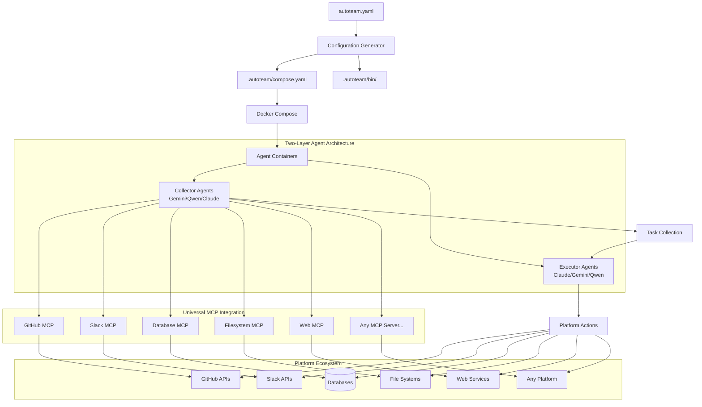

# AutoTeam

Universal AI Agent Management System powered by the Model Context Protocol (MCP) for platform-agnostic automation.

## Overview

AutoTeam is a cutting-edge system that orchestrates intelligent AI agents to work autonomously across any platform that supports the Model Context Protocol (MCP). Using a sophisticated two-layer architecture, AutoTeam agents can collect tasks from multiple platforms and execute them with context-aware intelligence, whether it's GitHub repositories, Slack channels, databases, file systems, or any other MCP-enabled service.

## Features

### 🌐 Universal Platform Integration
- **MCP Protocol Support**: Works with ANY platform that provides MCP servers (GitHub, Slack, databases, filesystems, web services, etc.)
- **Platform-Agnostic Design**: Add new platforms by simply configuring MCP servers - no code changes required
- **Multi-AI Agent Support**: Deploy Claude, Gemini, and Qwen agents with specialized capabilities
- **Universal Task Processing**: Agents understand context across different platforms and services

### 🏗️ Advanced Architecture
- **Two-Layer Agent System**: Clean separation between task collection (aggregation) and execution agents
- **Intelligent Agent Orchestration**: Multiple AI models working together with different strengths
- **Containerized Isolation**: Each agent runs in isolated Docker containers with dedicated configurations
- **Dynamic Scaling**: Deploy any number of specialized agents with custom roles and capabilities

### ⚙️ Configuration & Management
- **Universal Configuration**: Single YAML file to define agents, platforms, and MCP server connections
- **Agent-Specific Settings**: Per-agent Docker images, volumes, MCP servers, and environment overrides
- **Smart Name Normalization**: Automatically handles agent names with spaces and special characters
- **Flexible MCP Configuration**: Global, agent-settings, and agent-level MCP server configurations with priority merging

### 📊 Monitoring & Logging
- **Streaming Task Logs**: Individual log files per task with timestamped, normalized filenames
- **Real-time Processing**: Live task execution monitoring and output capture
- **Structured Logging**: Comprehensive logging with contextual information using zap
- **Organized File Structure**: Clean directory structure in `.autoteam/` with agent-specific subdirectories

### 🔧 Developer Experience  
- **Cross-Platform Support**: macOS and Linux with universal installation script
- **Docker-First Design**: Container-native deployment with Docker Compose orchestration
- **Template-Based Generation**: Automated configuration generation from templates
- **Comprehensive Testing**: Full test coverage with CI/CD integration

## Quick Start

### 1. Installation

**Quick Install (Recommended):**
```bash
# Install latest version (macOS/Linux)
curl -fsSL https://raw.githubusercontent.com/diazoxide/autoteam/main/scripts/install.sh | bash
```

**Manual Install:**
```bash
# Download for your platform from releases page
# Or build from source
make build && make install
```

**Verify Installation:**
```bash
autoteam --version
```

See [INSTALL.md](INSTALL.md) for comprehensive installation instructions.

### 2. Initialize Configuration

```bash
autoteam init
```

This creates a sample `autoteam.yaml` with basic configuration.

### 3. Configure Your Setup

Edit `autoteam.yaml` to define your AI agents and the platforms they should work with:

```yaml
agents:
  - name: "Platform Specialist"
    enabled: true
    prompt: |
      You are a platform specialist that can work across multiple services.
      Use available MCP tools to handle tasks from various platforms.
      Always provide helpful, accurate responses and take appropriate actions.
    settings:
      service:
        environment:
          GITHUB_TOKEN: ${PLATFORM_SPECIALIST_GITHUB_TOKEN}
          SLACK_TOKEN: ${PLATFORM_SPECIALIST_SLACK_TOKEN}
          DATABASE_URL: ${DATABASE_URL}
          
  - name: "Content Manager"
    enabled: true 
    prompt: |
      You are a content manager focused on documentation and communication.
      Help maintain wikis, update documentation, and manage content across platforms.
    settings:
      service:
        environment:
          NOTION_TOKEN: ${CONTENT_MANAGER_NOTION_TOKEN}
          GITHUB_TOKEN: ${CONTENT_MANAGER_GITHUB_TOKEN}
        image: "node:20"  # Custom image for content operations
        volumes:
          - "./content-tools:/opt/tools:ro"  # Content management tools

settings:
  service:
    image: "node:18.17.1"
    user: "developer"
    volumes:
      - "./shared/claude:/root/.claude"
      - "./shared/claude.json:/root/.claude.json"
  check_interval: 60
  team_name: "autoteam"
  install_deps: true
  
  # Two-Layer Architecture Configuration
  collector_agent:
    type: gemini
    args: ["--model", "gemini-2.5-flash"]
    prompt: |
      You are a task collector that discovers actionable items across all platforms.
      Use available MCP servers to check for tasks from any configured service.
      Report tasks in format: {PLATFORM}: {TASK DESCRIPTION}
      
  execution_agent:
    type: claude
    args: []
    prompt: |
      You are a universal task execution agent. Handle tasks from any platform.
      Use appropriate MCP tools for the platform: GitHub for code, Slack for messages, 
      databases for data operations, etc. Always complete tasks thoroughly.
      
  # Universal MCP Server Configuration
  mcp_servers:
    github:
      command: /opt/autoteam/bin/github-mcp-server
      args: ["stdio"]
      env:
        GITHUB_PERSONAL_ACCESS_TOKEN: $$GITHUB_TOKEN
    slack:
      command: /opt/autoteam/bin/slack-mcp-server
      args: ["stdio"]
      env:
        SLACK_BOT_TOKEN: $$SLACK_TOKEN
    database:
      command: /opt/autoteam/bin/sqlite-mcp-server
      args: ["stdio"]
      env:
        DATABASE_URL: $$DATABASE_URL
    filesystem:
      command: "npx"
      args: ["-y", "@modelcontextprotocol/server-filesystem", "/opt/workdir"]
```

### 4. Add Platform Credentials

Create a `.env` file in your project root to securely provide platform credentials:

```bash
# .env file - Platform credentials for MCP servers
PLATFORM_SPECIALIST_GITHUB_TOKEN=ghp_your_github_token
PLATFORM_SPECIALIST_SLACK_TOKEN=xoxb_your_slack_bot_token
DATABASE_URL=sqlite:///path/to/your/database.db

CONTENT_MANAGER_NOTION_TOKEN=secret_your_notion_token
CONTENT_MANAGER_GITHUB_TOKEN=ghp_your_content_github_token
```

These credentials enable your agents to work with different platforms through MCP servers. Each MCP server handles secure authentication for its respective platform.

### 5. Deploy Your Team

```bash
# Generate Docker Compose configuration
autoteam generate

# Start the automated team
autoteam up

# Stop when needed
autoteam down
```

## Configuration

### Agent Configuration

**Agent Properties:**
- `name`: Unique identifier for the agent (supports names with spaces and special characters)
- `prompt`: Primary role and responsibilities (supports multi-line YAML)
- `enabled`: Enable/disable agent without removing configuration (optional, defaults to true)
- `settings`: Agent-specific overrides for global settings (optional)
  - `service`: Docker service configuration overrides
    - `image`: Custom Docker image for this agent
    - `user`: Custom user for this agent  
    - `volumes`: Additional volume mounts
    - `environment`: Environment variables (including GITHUB_TOKEN)

**Example Agent Configuration:**
```yaml
agents:
  - name: "Senior Developer"
    enabled: true
    prompt: |
      You are a senior developer responsible for implementing features and fixes.
      Focus on code quality, testing, and comprehensive documentation.
    settings:
      service:
        environment:
          GITHUB_TOKEN: ${DEVELOPER_GITHUB_TOKEN}
        image: "golang:1.21"
        volumes:
          - "./custom-tools:/opt/tools:ro"
```

### Global Settings

**Service Configuration:**
- `service`: Docker service defaults applied to all agents
  - `image`: Default Docker image for agent containers
  - `user`: Default user account inside containers
  - `volumes`: Default volume mounts applied to all agents
  - `environment`: Default environment variables for all agents

**Two-Layer Architecture:**
- `collector_agent`: First layer configuration (task collection)
  - `type`: Agent type (gemini, claude, qwen)
  - `args`: Command line arguments
  - `prompt`: Collection-specific prompt
- `execution_agent`: Second layer configuration (task execution)
  - `type`: Agent type (gemini, claude, qwen)  
  - `args`: Command line arguments
  - `prompt`: Execution-specific prompt

**System Settings:**
- `check_interval`: Monitoring frequency in seconds
- `team_name`: Project name used in paths and Docker Compose project name
- `install_deps`: Install dependencies on container startup
- `common_prompt`: Common instructions shared by all agents (optional)
- `mcp_servers`: Global MCP (Model Context Protocol) servers for all agents

### MCP Server Configuration

AutoTeam supports Model Context Protocol (MCP) servers to enhance agent capabilities with additional context and tools. MCP servers can be configured at three levels with priority-based merging:

1. **Global Level** (`settings.mcp_servers`): Applied to all agents
2. **Agent Settings Level** (`agent.settings.mcp_servers`): Applied to specific agent, overrides global
3. **Agent Level** (`agent.mcp_servers`): Highest priority, overrides both global and agent settings

**Configuration Example:**
```yaml
# Global MCP servers (applied to all agents)
settings:
  mcp_servers:
    github:
      command: /opt/autoteam/bin/github-mcp-server
      args: ["stdio"]
      env:
        GITHUB_PERSONAL_ACCESS_TOKEN: $$GITHUB_TOKEN
    memory:
      command: "npx"
      args: ["-y", "mcp-memory-service"]

agents:
  - name: "developer"
    prompt: |
      You are a developer agent responsible for implementing features.
    settings:
      service:
        environment:
          GITHUB_TOKEN: ${DEVELOPER_GITHUB_TOKEN}
      # Agent settings-level MCP servers (medium priority)
      mcp_servers:
        filesystem:
          command: "npx"
          args: ["-y", "mcp-filesystem-server"]
    # Agent-level MCP servers (highest priority)
    mcp_servers:
      sqlite:
        command: "npx"
        args: ["-y", "mcp-sqlite-server"]
        env:
          DATABASE_URL: "sqlite:///opt/autoteam/agents/developer/collector/data.db"
```

**MCP Server Properties:**
- `command`: Executable command to run the MCP server
- `args`: Command line arguments (optional)
- `env`: Environment variables for the MCP server (optional)

**Popular MCP Servers:**
- **GitHub**: `@github/github-mcp-server` - Enhanced GitHub operations and context
- **Memory**: `mcp-memory-service` - Persistent conversation history
- **SQLite**: `mcp-sqlite-server` - Database persistence and queries
- **Filesystem**: `mcp-filesystem-server` - File system operations with context
- **Web**: `mcp-web-server` - Web browsing and content fetching

**Merging Behavior:**
- Same-named servers at higher priority levels completely replace lower priority ones
- Different-named servers from all levels are combined
- Agent-level > Agent Settings-level > Global-level priority

### Intelligent Notification Processing

AutoTeam uses a sophisticated notification processing system that handles GitHub events intelligently:

**Notification Types Supported:**
- **Review Requests**: Professional code review workflow with quality guidelines
- **Assigned Issues**: Smart intent detection for consultation vs implementation requests
- **Assigned PRs**: Complete pull request handling workflow
- **Mentions**: Context analysis to determine if consultation or action is needed
- **Failed Workflows**: CI/CD failure investigation and automatic fixing
- **Unread Comments**: Thread-appropriate responses based on comment type
- **Generic Notifications**: Fallback handling for unknown notification types

**Key Features:**
- **Type-Specific Prompts**: Each notification type gets specialized guidance
- **Intent Recognition**: Distinguishes between "What do you think?" (consultation) vs "Please implement" (action)
- **AI-Driven Validation**: Uses GitHub CLI commands to check if notifications are still current
- **Automatic Read Marking**: Prevents duplicate processing by marking notifications as read
- **Context-Aware Responses**: Agents respond appropriately based on notification type and user intent

This prevents the common problem where agents over-implement when users are simply asking for advice or opinions.

### Intent Recognition Examples

The system intelligently distinguishes between different types of requests:

**Consultation Requests (Comment Only):**
- "What do you think about this approach?"
- "How should we structure the database?"
- "Any thoughts on the best way to implement OAuth?"
- "What's your opinion on using GraphQL here?"

**Implementation Requests (Create PRs/Code):**
- "Please implement user authentication"
- "Fix the memory leak in the parser"
- "Add support for file uploads"
- "Create a REST API endpoint for users"

**Smart Response Behavior:**
- **For Consultation**: Agents provide thoughtful analysis and recommendations via comments
- **For Implementation**: Agents write code, create pull requests, and implement solutions
- **For Reviews**: Agents examine code thoroughly and provide professional feedback
- **For CI Failures**: Agents investigate logs, identify issues, and create fixes

## Examples

See the [`examples/`](examples/) directory for various configuration patterns:

- **basic-setup.yaml**: Simple two-agent setup
- **multi-role-team.yaml**: Comprehensive team with specialized roles
- **minimal-config.yaml**: Absolute minimum configuration
- **custom-docker.yaml**: Custom Docker image example

## CLI Commands

```bash
autoteam init      # Create sample autoteam.yaml
autoteam generate  # Generate compose.yaml from config
autoteam up        # Generate and start containers
autoteam down      # Stop containers
autoteam agents     # List all agents and their states
```

All generated files are organized in the `.autoteam/` directory for better project organization.

### Agent Name Normalization

AutoTeam automatically normalizes agent names for Docker Compose services and directory paths while preserving the original names for identification:

```yaml
agents:
  - name: "Senior Developer"      # Original name (used in environment variables)
    prompt: "You are a senior developer"
    settings:
      service:
        environment:
          GITHUB_TOKEN: ${SENIOR_DEVELOPER_GITHUB_TOKEN}
  - name: "API Agent #1"          # Original name with special characters
    prompt: "You are an API specialist"
    settings:
      service:
        environment:
          GITHUB_TOKEN: ${API_AGENT_GITHUB_TOKEN}
```

This generates Docker Compose services with normalized names:
- `Senior Developer` → `senior_developer` (service name)
- `API Agent #1` → `api_agent_1` (service name)

Directory structure uses normalized names with two-layer architecture:
```
.autoteam/agents/
├── senior_developer/
│   ├── collector/          # Task collection agent (Gemini/Qwen)
│   │   ├── .gemini/        # Gemini CLI configuration
│   │   └── codebase/       # Repository clones
│   ├── executor/           # Task execution agent (Claude)
│   │   ├── mcp.json        # Claude MCP configuration
│   │   └── codebase/       # Repository clones
│   └── codebase/           # Shared repository access
└── api_agent_1/
    ├── collector/
    │   ├── .qwen/          # Qwen Code configuration
    │   └── codebase/
    ├── executor/
    │   ├── mcp.json
    │   └── codebase/
    └── codebase/
```

### Disabling Agents

You can temporarily disable agents without removing their configuration:

```yaml
agents:
  - name: "developer"
    prompt: "You are a developer agent"
    settings:
      service:
        environment:
          GITHUB_TOKEN: ${DEVELOPER_GITHUB_TOKEN}
    enabled: true  # Agent is active (default)
  
  - name: "reviewer"
    prompt: "You are a code reviewer"
    settings:
      service:
        environment:
          GITHUB_TOKEN: ${REVIEWER_GITHUB_TOKEN}
    enabled: false  # Agent is disabled - won't be deployed
```

Benefits:
- Keep agent configurations for future use
- Temporarily reduce resource usage
- Test with specific agent combinations
- Preserve tokens and settings when not actively needed

Use `autoteam agents` to list all agents and their states.

## Architecture



### Universal MCP-Based Design

AutoTeam's architecture is built around the Model Context Protocol (MCP), enabling seamless integration with any platform:

- **Aggregation Layer**: AI agents discover tasks using MCP servers from multiple platforms
- **Execution Layer**: Specialized AI agents handle tasks using appropriate MCP tools  
- **Platform Abstraction**: MCP servers provide standardized interfaces to any service
- **Agent Orchestration**: Container-based agents with per-agent MCP configurations

### Multi-Platform Agent Structure

Each agent maintains separate working directories with two-layer architecture and platform-specific configurations:

```
./
├── autoteam.yaml          # Universal platform configuration
└── .autoteam/             # Generated files directory
    ├── compose.yaml       # Docker Compose configuration
    ├── agents/            # Agent-specific directories
    │   ├── platform_specialist/
    │   │   ├── collector/          # Task collection layer (Gemini)
    │   │   │   ├── .gemini/        # Gemini CLI config
    │   │   │   ├── data/           # Platform-specific data
    │   │   │   │   ├── github/     # GitHub workspace
    │   │   │   │   ├── slack/      # Slack workspace  
    │   │   │   │   └── database/   # Database workspace
    │   │   │   └── logs/           # Collection logs
    │   │   ├── executor/           # Task execution layer (Claude)
    │   │   │   ├── .mcp.json       # Agent-specific MCP config
    │   │   │   ├── data/           # Execution workspace
    │   │   │   │   ├── github/     # Code repositories
    │   │   │   │   ├── slack/      # Message contexts
    │   │   │   │   └── database/   # Data operations
    │   │   │   └── logs/           # Execution logs with streaming
    │   │   └── shared/             # Shared resources
    │   └── content_manager/
    │       ├── collector/          # Task discovery (Qwen)
    │       │   ├── .qwen/          # Qwen configuration
    │       │   ├── data/           # Multi-platform data
    │       │   └── logs/           # Collection logs
    │       ├── executor/           # Content operations (Claude)
    │       │   ├── .mcp.json       # MCP server configuration
    │       │   ├── data/           # Content workspaces
    │       │   └── logs/           # Task execution logs
    │       └── shared/             # Shared configurations
    ├── bin/               # Unified binary directory
    │   ├── autoteam-entrypoint-*
    │   ├── entrypoint.sh
    │   ├── github-mcp-server      # GitHub MCP server
    │   ├── slack-mcp-server       # Slack MCP server
    │   ├── sqlite-mcp-server      # Database MCP server
    │   └── custom-mcp-servers/    # Custom MCP implementations
    └── shared/            # Shared configurations
        ├── claude/
        ├── claude.json
        └── gemini/
```

### Platform Integration Patterns

- **MCP Server Discovery**: Automatically detect and configure available MCP servers
- **Multi-Platform Monitoring**: Collect tasks from multiple platforms simultaneously  
- **Context-Aware Processing**: Agents understand platform-specific context and requirements
- **Dynamic Platform Addition**: Add new platforms by installing MCP servers - no code changes needed

## Testing

The project includes comprehensive test coverage:

```bash
# Run all tests
go test ./...

# Run with verbose output
go test -v ./...

# Run specific package tests
go test ./internal/config
go test ./internal/generator
go test ./cmd/autoteam
go test ./cmd/entrypoint
```

### Test Coverage

- **Unit Tests**: Config parsing, validation, template generation
- **Integration Tests**: CLI command workflows
- **Template Tests**: Docker Compose and entrypoint generation
- **Normalization Tests**: Agent name normalization with various edge cases
- **Error Handling**: Invalid configurations and edge cases

## Development

### Project Structure

```
./
├── cmd/
│   ├── autoteam/          # Main CLI application
│   └── entrypoint/        # Go binary entrypoint for agents
├── internal/
│   ├── config/            # Configuration parsing
│   ├── generator/         # Template generation & embedded templates
│   └── testutil/          # Test utilities
├── examples/              # Configuration examples
├── scripts/               # Installation and utility scripts
└── .autoteam/             # Generated agent directories (created at runtime)
```

### Building & Development

```bash
# Development build
make dev

# Build for current platform
make build

# Build for all platforms  
make build-all

# Run tests
make test

# Format and lint
make check

# Create release packages
make package

# Install to system
make install
```

See `make help` for all available targets.

## Security Considerations

- **Platform Credentials**: Use separate tokens/credentials for each agent and platform
- **Minimal Permissions**: Configure minimal required permissions for all platform tokens
- **Credential Validation**: Ensure credentials match the intended service accounts
- **Regular Rotation**: Regularly rotate access tokens and API keys across all platforms
- **Rate Limit Monitoring**: Monitor API usage across all integrated platforms
- **Container Security**: Review generated Docker configurations and agent isolation
- **Environment Variables**: Use `.env` files for sensitive credentials - never commit to version control
- **MCP Server Security**: Ensure MCP servers run with appropriate permissions and network access controls

## Troubleshooting

### Common Issues

1. **Platform Authentication**: Ensure tokens are properly set for all configured platforms (GitHub, Slack, databases, etc.)
2. **MCP Server Connectivity**: Verify MCP servers are running and accessible to agents
3. **Docker Issues**: Verify Docker and Docker Compose are installed and running
4. **API Rate Limits**: Monitor rate limits across all integrated platforms
5. **Port Conflicts**: Check for container port conflicts
6. **Permission Issues**: Ensure proper file permissions for generated scripts and MCP configurations
7. **Agent Communication**: Verify agents can communicate with their assigned MCP servers
8. **Multi-Platform Access**: Ensure credentials have access to all configured services and platforms
9. **MCP Protocol Issues**: Check MCP server logs for protocol-specific errors

### Debug Mode

```bash
# Check generated files
autoteam generate
cat .autoteam/compose.yaml
ls .autoteam/bin/

# Verify MCP server connectivity
docker-compose -f .autoteam/compose.yaml logs | grep -E "(MCP|mcp)"

# Check individual agent working directories and MCP configurations
ls .autoteam/agents/agent-name/collector/data/
ls .autoteam/agents/agent-name/executor/data/
cat .autoteam/agents/agent-name/executor/.mcp.json

# Test individual containers
docker-compose -f .autoteam/compose.yaml up agent-name

# View platform task processing logs
docker-compose -f .autoteam/compose.yaml logs agent-name | grep -E "(Task|Processing|Platform|MCP)"

# Monitor real-time multi-platform activity
docker-compose -f .autoteam/compose.yaml logs -f --tail=50

# View streaming task logs for individual tasks
ls .autoteam/agents/agent-name/executor/logs/
cat .autoteam/agents/agent-name/executor/logs/20250814-121735-process_slack_message.log
cat .autoteam/agents/agent-name/executor/logs/20250814-122304-update_database_record.log
```

## Streaming Task Logs

AutoTeam provides detailed task-specific logging for the executor layer with individual log files for each task:

### Log File Structure

Each task execution creates a separate log file with the format:
```
.autoteam/agents/{agent-name}/executor/logs/{YYYYMMDD-HHMMSS}-{normalized_task_name}.log
```

**Examples:**
```
20250814-121735-handle_bug_fix_in_parser.log
20250814-122015-review_pull_request_for_authentication.log
20250814-122304-implement_user_dashboard_feature.log
```

### Log Features

- **Timestamped Files**: Each log file starts with execution timestamp (YYYYMMDD-HHMMSS)
- **Normalized Names**: Task descriptions converted to safe, lowercase filenames
- **Real-time Streaming**: Logs written immediately during execution (not batched at completion)
- **Complete Output**: Captures both stdout and stderr from agent execution
- **Task Context**: Each log includes the original task description and execution metadata
- **Backward Compatible**: Maintains existing `output.txt` functionality

### Viewing Task Logs

```bash
# List all task logs for an agent
ls .autoteam/agents/senior_developer/executor/logs/

# View specific task execution
cat .autoteam/agents/senior_developer/executor/logs/20250814-121735-fix_memory_leak_issue.log

# Monitor latest task logs in real-time
tail -f .autoteam/agents/senior_developer/executor/logs/*.log

# Find logs for specific task types
ls .autoteam/agents/senior_developer/executor/logs/*review*.log
ls .autoteam/agents/senior_developer/executor/logs/*implement*.log
```

### Log Content Format

Each log file contains:
- **Header**: Task description and execution timestamp
- **Agent Stdout**: Complete output from the AI agent
- **Agent Stderr**: Any error messages or warnings
- **Completion**: Task completion timestamp

This detailed logging makes it easy to debug individual task executions, track agent behavior over time, and understand how specific notifications were processed.

## Contributing

1. Fork the repository
2. Create a feature branch
3. Add tests for new functionality
4. Ensure all tests pass
5. Submit a pull request

## License

This project is licensed under the MIT License - see the LICENSE file for details.
