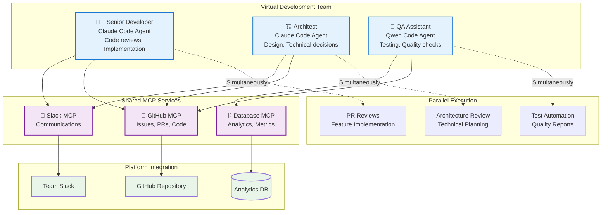
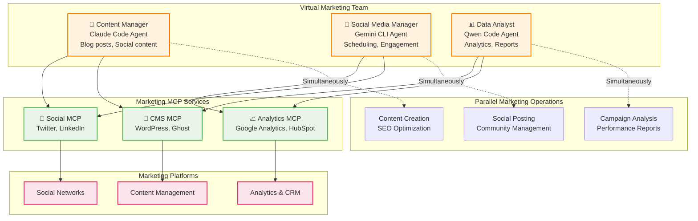
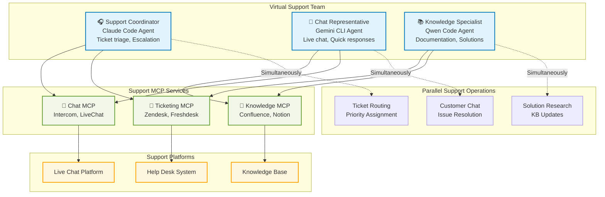
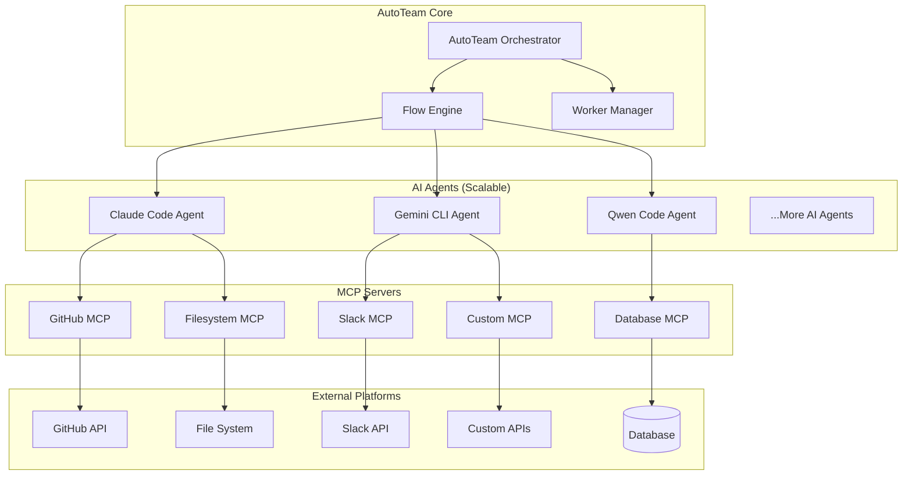
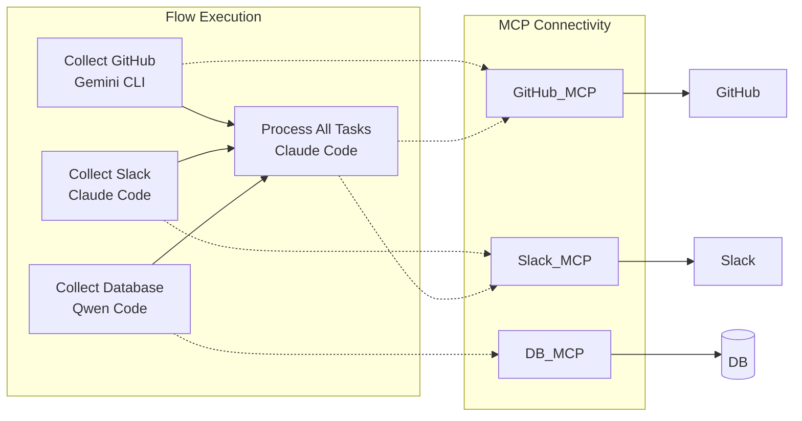

# AutoTeam 🤖

<div align="center">

[](https://golang.org)
[](LICENSE)
[](https://github.com/diazoxide/autoteam/stargazers)
[](https://hub.docker.com/r/diazoxide/autoteam)

**Universal AI Agent Orchestration Platform powered by Model Context Protocol (MCP)**

[Documentation](docs/) • [Installation](docs/installation.md) • [Configuration](docs/configuration.md) • [Examples](examples/) • [Contributing](#contributing)

</div>

---

AutoTeam is a platform-agnostic orchestration system that connects AI agents with any service through MCP servers. Think of it as an **MCP hub** that enables intelligent workflows across platforms, databases, APIs, and services.

## 🎯 What is AutoTeam?

AutoTeam orchestrates AI agents (Claude Code, Gemini CLI, Qwen Code, and more) to work autonomously across any platform that supports MCP. The agent list is fully extensible - add any AI tool that fits your needs. Instead of building custom integrations, you configure MCP servers and let intelligent agents handle complex, multi-platform workflows.

### Why AutoTeam?

- 🚀 **10x Productivity**: Teams report handling 5-10x more routine tasks
- 🔗 **Universal Integration**: Connect any MCP-enabled service without custom code
- 🤝 **True Collaboration**: AI agents work in parallel, like real team members
- 📈 **Scalable Architecture**: Add agents and services as your needs grow
- 🛡️ **Enterprise Ready**: Container-native with full security isolation

## 👥 Scale Your Team with Virtual Workers

Transform your development workflow by adding AI agents as virtual team members. Each agent specializes in different roles and works in parallel, dramatically scaling your team's capacity:


```mermaid
graph TB
    subgraph "Virtual Development Team"
        SD[👨‍💻 Senior Developer<br/>Claude Code Agent<br/>Code reviews, Implementation]
        ARCH[🏗️ Architect<br/>Claude Code Agent<br/>Design, Technical decisions]
        QA[🧪 QA Assistant<br/>Qwen Code Agent<br/>Testing, Quality checks]
    end
    
    subgraph "Parallel Execution"
        SD -.->|Simultaneously| FLOW1[PR Reviews<br/>Feature Implementation]
        ARCH -.->|Simultaneously| FLOW2[Architecture Review<br/>Technical Planning]
        QA -.->|Simultaneously| FLOW3[Test Automation<br/>Quality Reports]
    end
    
    subgraph "Shared MCP Services"
        GitHub_MCP[🐙 GitHub MCP<br/>Issues, PRs, Code]
        Slack_MCP[💬 Slack MCP<br/>Communications]
        DB_MCP[🗄️ Database MCP<br/>Analytics, Metrics]
    end
    
    subgraph "Platform Integration"
        GitHub[GitHub Repository]
        Slack[Team Slack]
        Analytics[(Analytics DB)]
    end
    
    SD --> GitHub_MCP
    ARCH --> GitHub_MCP
    QA --> GitHub_MCP
    
    SD --> Slack_MCP
    ARCH --> Slack_MCP
    QA --> DB_MCP
    
    GitHub_MCP --> GitHub
    Slack_MCP --> Slack
    DB_MCP --> Analytics
    
    classDef agent fill:#e3f2fd,stroke:#1976d2,stroke-width:2px
    classDef mcp fill:#f3e5f5,stroke:#7b1fa2,stroke-width:2px
    classDef platform fill:#e8f5e8,stroke-width:2px
    
    class SD,ARCH,QA agent
    class GitHub_MCP,Slack_MCP,DB_MCP mcp
    class GitHub,Slack,Analytics platform
```

**Real Impact**: Teams report handling 5-10x more routine tasks with virtual workers, allowing humans to focus on strategy and complex problem-solving.

## 📣 Marketing Team Automation

AutoTeam also scales non-technical teams. Here's how a marketing team leverages AI agents for content creation, campaign management, and analytics:


```mermaid
graph TB
    subgraph "Virtual Marketing Team"
        CM[📝 Content Manager<br/>Claude Code Agent<br/>Blog posts, Social content]
        SM[📱 Social Media Manager<br/>Gemini CLI Agent<br/>Scheduling, Engagement]
        DA[📊 Data Analyst<br/>Qwen Code Agent<br/>Analytics, Reports]
    end
    
    subgraph "Parallel Marketing Operations"
        CM -.->|Simultaneously| MFLOW1[Content Creation<br/>SEO Optimization]
        SM -.->|Simultaneously| MFLOW2[Social Posting<br/>Community Management]
        DA -.->|Simultaneously| MFLOW3[Campaign Analysis<br/>Performance Reports]
    end
    
    subgraph "Marketing MCP Services"
        CMS_MCP[📄 CMS MCP<br/>WordPress, Ghost]
        Social_MCP[📲 Social MCP<br/>Twitter, LinkedIn]
        Analytics_MCP[📈 Analytics MCP<br/>Google Analytics, HubSpot]
    end
    
    subgraph "Marketing Platforms"
        CMS[Content Management]
        SocialPlatforms[Social Networks]
        MarketingTools[Analytics & CRM]
    end
    
    CM --> CMS_MCP
    SM --> Social_MCP
    DA --> Analytics_MCP
    
    CM --> Social_MCP
    SM --> Analytics_MCP
    DA --> CMS_MCP
    
    CMS_MCP --> CMS
    Social_MCP --> SocialPlatforms
    Analytics_MCP --> MarketingTools
    
    classDef agent fill:#fff3e0,stroke:#f57c00,stroke-width:2px
    classDef mcp fill:#e8f5e8,stroke:#4caf50,stroke-width:2px
    classDef platform fill:#fce4ec,stroke:#e91e63,stroke-width:2px
    
    class CM,SM,DA agent
    class CMS_MCP,Social_MCP,Analytics_MCP mcp
    class CMS,SocialPlatforms,MarketingTools platform
```

**Marketing Results**: Content production increased 400%, social engagement up 250%, with data-driven insights delivered daily instead of monthly.

## 🎧 Customer Support Team Automation

Scale your support operations with AI agents that handle multiple channels simultaneously, ensuring no customer request goes unnoticed:


```mermaid
graph TB
    subgraph "Virtual Support Team"
        SC[🎧 Support Coordinator<br/>Claude Code Agent<br/>Ticket triage, Escalation]
        CR[💬 Chat Representative<br/>Gemini CLI Agent<br/>Live chat, Quick responses]
        KB[📚 Knowledge Specialist<br/>Qwen Code Agent<br/>Documentation, Solutions]
    end
    
    subgraph "Parallel Support Operations"
        SC -.->|Simultaneously| SFLOW1[Ticket Routing<br/>Priority Assignment]
        CR -.->|Simultaneously| SFLOW2[Customer Chat<br/>Issue Resolution]
        KB -.->|Simultaneously| SFLOW3[Solution Research<br/>KB Updates]
    end
    
    subgraph "Support MCP Services"
        Ticket_MCP[🎫 Ticketing MCP<br/>Zendesk, Freshdesk]
        Chat_MCP[💭 Chat MCP<br/>Intercom, LiveChat]
        KB_MCP[📖 Knowledge MCP<br/>Confluence, Notion]
    end
    
    subgraph "Support Platforms"
        HelpDesk[Help Desk System]
        ChatPlatform[Live Chat Platform]
        KnowledgeBase[Knowledge Base]
    end
    
    SC --> Ticket_MCP
    CR --> Chat_MCP
    KB --> KB_MCP
    
    SC --> Chat_MCP
    CR --> KB_MCP
    KB --> Ticket_MCP
    
    Ticket_MCP --> HelpDesk
    Chat_MCP --> ChatPlatform
    KB_MCP --> KnowledgeBase
    
    classDef agent fill:#e1f5fe,stroke:#0277bd,stroke-width:2px
    classDef mcp fill:#f1f8e9,stroke:#689f38,stroke-width:2px
    classDef platform fill:#fef7e0,stroke:#ffa000,stroke-width:2px
    
    class SC,CR,KB agent
    class Ticket_MCP,Chat_MCP,KB_MCP mcp
    class HelpDesk,ChatPlatform,KnowledgeBase platform
```

**Support Results**: 60% faster response times, 45% better escalation accuracy, 24/7 coverage with consistent service quality across all channels.


```mermaid
graph TB
    subgraph "AutoTeam Core"
        ATC[AutoTeam Orchestrator]
        FE[Flow Engine]
        WM[Worker Manager]
    end
    
    subgraph "AI Agents (Scalable)"
        Claude[Claude Code Agent]
        Gemini[Gemini CLI Agent]
        Qwen[Qwen Code Agent]
        More[...More AI Agents]
    end
    
    subgraph "MCP Servers"
        GMCP[GitHub MCP]
        SMCP[Slack MCP]
        DMCP[Database MCP]
        FMCP[Filesystem MCP]
        CMCP[Custom MCP]
    end
    
    subgraph "External Platforms"
        GitHub[GitHub API]
        Slack[Slack API]
        Database[(Database)]
        FileSystem[File System]
        Custom[Custom APIs]
    end
    
    ATC --> FE
    ATC --> WM
    FE --> Claude
    FE --> Gemini
    FE --> Qwen
    
    Claude --> GMCP
    Gemini --> SMCP
    Qwen --> DMCP
    Claude --> FMCP
    Gemini --> CMCP
    
    GMCP --> GitHub
    SMCP --> Slack
    DMCP --> Database
    FMCP --> FileSystem
    CMCP --> Custom
```

## ✨ Key Features

| Feature | Description |
|---------|-------------|
| 🌐 **Universal Platform Integration** | Connect any MCP-enabled service without custom code |
| 🔄 **Intelligent Flow Orchestration** | Parallel execution with smart dependency resolution |
| 🤖 **Multi-AI Agent Support** | Claude Code, Gemini CLI, Qwen Code, and more working together |
| 🏗️ **Container-Native Architecture** | Isolated, secure, and scalable agent deployment |
| 🚀 **Runtime Abstraction** | Flexible deployment runtime (Docker, Kubernetes, etc.) with native API control |
| ⚙️ **Configuration-Driven** | Define complex workflows in simple YAML |
| 🔌 **Extensible Plugin System** | Add custom MCP servers and AI agents |
| 📊 **Real-time Monitoring** | Track agent performance and workflow execution |
| 🎛️ **Control Plane API** | Centralized worker management with Swagger UI |
| 🔐 **Enterprise Security** | Role-based access control and secure credentials |  

## 🏗️ Architecture Overview

AutoTeam acts as an intelligent MCP hub, enabling seamless communication between AI agents and platforms:


```mermaid
graph LR
    subgraph "Flow Execution"
        F1[Collect GitHub<br/>Gemini CLI]
        F2[Collect Slack<br/>Claude Code]
        F3[Collect Database<br/>Qwen Code]
        F4[Process All Tasks<br/>Claude Code]
        
        F1 --> F4
        F2 --> F4
        F3 --> F4
    end
    
    subgraph "MCP Connectivity"
        F1 -.-> GitHub_MCP
        F2 -.-> Slack_MCP
        F3 -.-> DB_MCP
        F4 -.-> GitHub_MCP
        F4 -.-> Slack_MCP
    end
    
    GitHub_MCP --> GitHub_API[GitHub]
    Slack_MCP --> Slack_API[Slack]
    DB_MCP --> Database_API[(DB)]
```

## 🚀 Quick Start

### Prerequisites

- Docker 20.10+ or Podman 3.0+
- 4GB RAM minimum (8GB recommended)
- Linux, macOS, or Windows with WSL2

### 1. Install
```bash
# One-line installation
curl -fsSL https://raw.githubusercontent.com/diazoxide/autoteam/main/scripts/install.sh | bash

# Or with specific version
curl -fsSL https://raw.githubusercontent.com/diazoxide/autoteam/main/scripts/install.sh | bash -s -- --version v1.0.0
```

### 2. Initialize
```bash
# Create a new AutoTeam project
autoteam init

# Or initialize with a template
autoteam init --template development-team
```

### 3. Configure
```yaml
# autoteam.yaml
workers:
  - name: "AI Assistant"
    enabled: true
    prompt: "Handle tasks across platforms using available MCP tools"

settings:
  mcp_servers:
    github:
      command: /opt/autoteam/bin/github-mcp-server
      args: ["stdio"]
    slack:
      command: /opt/autoteam/bin/slack-mcp-server
      args: ["stdio"]

  flow:
    - name: process_tasks
      type: claude
      prompt: "Process tasks using MCP tools"
```

### 4. Generate Configuration (Optional)
```bash
# Generate configuration files for the runtime
autoteam generate
```

### 5. Deploy
```bash
autoteam up
```

### 6. Monitor (Optional)
```bash
# Access control plane API at http://localhost:9090
# View Swagger UI at http://localhost:9090/docs/
```

## 📚 Documentation

### Getting Started
- 📖 [Installation Guide](docs/installation.md) - Complete setup instructions
- ⚙️ [Configuration](docs/configuration.md) - Platform and agent configuration
- 🚀 [Examples](docs/examples.md) - Real-world use cases and templates

### Advanced Topics
- 🔄 [Flow System](docs/flows.md) - Workflow definition and orchestration
- 🔌 [MCP Integration](docs/mcp.md) - Platform connectivity guide
- 🏗️ [Architecture](docs/architecture.md) - System design deep dive
- 🛠️ [Development](docs/development.md) - Contributing and extending AutoTeam

### Quick Links
- [API Reference](https://pkg.go.dev/github.com/diazoxide/autoteam)
- [Control Plane API](docs/control-plane.md)
- [CLI Commands](docs/cli.md)
- [Troubleshooting](docs/troubleshooting.md)
- [FAQ](docs/faq.md)  

## 💡 Use Cases

### Development Teams
- 🔍 **Code Review Automation** - Parallel PR reviews with multiple AI perspectives
- 🐛 **Issue Management** - Automatic triage, labeling, and assignment
- 🚀 **CI/CD Enhancement** - Intelligent build failure analysis and fixes
- 📝 **Documentation Generation** - Keep docs in sync with code changes

### Marketing Teams
- ✍️ **Content Production** - Blog posts, social media, email campaigns
- 📊 **Analytics Automation** - Daily reports and campaign insights
- 🎯 **SEO Optimization** - Content analysis and improvement suggestions
- 📱 **Social Media Management** - Multi-platform posting and engagement

### Customer Support
- 🎫 **Ticket Automation** - Intelligent routing and prioritization
- 💬 **Multi-Channel Support** - Unified response across chat, email, social
- 📚 **Knowledge Base Updates** - Automatic solution documentation
- 📈 **Support Analytics** - Performance metrics and trend analysis

### Data Operations
- 🔄 **ETL Pipelines** - Intelligent data transformation workflows
- 📊 **Report Generation** - Automated insights and visualizations
- 🔍 **Data Quality** - Validation and anomaly detection
- 🗄️ **Database Management** - Schema updates and optimization

## 💻 Example: Multi-Platform Workflow

```yaml
flow:
  # Parallel data collection
  - name: scan_github
    type: gemini
    prompt: "Collect urgent GitHub notifications"
  - name: scan_slack
    type: claude  
    prompt: "Check Slack for team mentions"
    
  # Process collected data
  - name: handle_tasks
    type: claude
    depends_on: [scan_github, scan_slack]
    prompt: "Process all collected tasks with appropriate actions"
```

## 🤝 Contributing

AutoTeam is open source and welcomes contributions!

### How to Contribute

1. ⭐ **Star the repository** to show your support
2. 🐛 **Report bugs** via [GitHub Issues](https://github.com/diazoxide/autoteam/issues)
3. 💡 **Request features** in [Discussions](https://github.com/diazoxide/autoteam/discussions)
4. 🔧 **Submit pull requests** - see [Contributing Guide](CONTRIBUTING.md)
5. 📖 **Improve documentation** - even typo fixes are valuable!
6. 🔌 **Create MCP integrations** - expand the ecosystem

### Development Setup

```bash
# Clone the repository
git clone https://github.com/diazoxide/autoteam.git
cd autoteam

# Install dependencies
make deps

# Run tests
make test

# Build locally
make build
```

## 🔒 Security

For security issues, please email security@autoteam.io instead of using the issue tracker. See our [Security Policy](SECURITY.md) for more details.

## 📄 License

MIT License - see [LICENSE](LICENSE) for details.

## 🙏 Acknowledgments

- [Anthropic](https://anthropic.com) for Claude and MCP
- [Google](https://google.com) for Gemini
- [Alibaba Cloud](https://alibabacloud.com) for Qwen
- All our [contributors](https://github.com/diazoxide/autoteam/graphs/contributors)

---

<div align="center">

**Ready to orchestrate your AI agents?**

[🚀 Get Started](docs/installation.md) • [📖 Read Docs](docs/)

</div>
