# AutoTeam

**Universal AI Agent Orchestration Platform powered by Model Context Protocol (MCP)**

AutoTeam is a platform-agnostic orchestration system that connects AI agents with any service through MCP servers. Think of it as an MCP hub that enables intelligent workflows across platforms, databases, APIs, and services.

## What is AutoTeam?

AutoTeam orchestrates AI agents (Claude, Gemini, Qwen) to work autonomously across any platform that supports MCP. Instead of building custom integrations, you configure MCP servers and let intelligent agents handle complex, multi-platform workflows.

## Scale Your Team with Virtual Workers

Transform your development workflow by adding AI agents as virtual team members. Each agent specializes in different roles and works in parallel, dramatically scaling your team's capacity:

```mermaid
graph TB
    subgraph "Virtual Development Team"
        SD[👨‍💻 Senior Developer<br/>Claude Agent<br/>Code reviews, Implementation]
        ARCH[🏗️ Architect<br/>Claude Agent<br/>Design, Technical decisions]
        QA[🧪 QA Assistant<br/>Qwen Agent<br/>Testing, Quality checks]
    end
    
    subgraph "Parallel Execution"
        SD -.->|Simultaneously| FLOW1[PR Reviews<br/>Feature Implementation]
        ARCH -.->|Simultaneously| FLOW2[Architecture Review<br/>Technical Planning]
        QA -.->|Simultaneously| FLOW3[Test Automation<br/>Quality Reports]
    end
    
    subgraph "Shared MCP Services"
        GitHub_MCP[🐙 GitHub MCP<br/>Issues, PRs, Code]
        Slack_MCP[💬 Slack MCP<br/>Communications]
        DB_MCP[🗄️ Database MCP<br/>Analytics, Metrics]
    end
    
    subgraph "Platform Integration"
        GitHub[GitHub Repository]
        Slack[Team Slack]
        Analytics[(Analytics DB)]
    end
    
    SD --> GitHub_MCP
    ARCH --> GitHub_MCP
    QA --> GitHub_MCP
    
    SD --> Slack_MCP
    ARCH --> Slack_MCP
    QA --> DB_MCP
    
    GitHub_MCP --> GitHub
    Slack_MCP --> Slack
    DB_MCP --> Analytics
    
    classDef agent fill:#e3f2fd,stroke:#1976d2,stroke-width:2px
    classDef mcp fill:#f3e5f5,stroke:#7b1fa2,stroke-width:2px
    classDef platform fill:#e8f5e8,stroke-width:2px
    
    class SD,ARCH,QA agent
    class GitHub_MCP,Slack_MCP,DB_MCP mcp
    class GitHub,Slack,Analytics platform
```



**Real Impact**: Teams report handling 5-10x more routine tasks with virtual workers, allowing humans to focus on strategy and complex problem-solving.

## Marketing Team Automation

AutoTeam also scales non-technical teams. Here's how a marketing team leverages AI agents for content creation, campaign management, and analytics:

```mermaid
graph TB
    subgraph "Virtual Marketing Team"
        CM[📝 Content Manager<br/>Claude Agent<br/>Blog posts, Social content]
        SM[📱 Social Media Manager<br/>Gemini Agent<br/>Scheduling, Engagement]
        DA[📊 Data Analyst<br/>Qwen Agent<br/>Analytics, Reports]
    end
    
    subgraph "Parallel Marketing Operations"
        CM -.->|Simultaneously| MFLOW1[Content Creation<br/>SEO Optimization]
        SM -.->|Simultaneously| MFLOW2[Social Posting<br/>Community Management]
        DA -.->|Simultaneously| MFLOW3[Campaign Analysis<br/>Performance Reports]
    end
    
    subgraph "Marketing MCP Services"
        CMS_MCP[📄 CMS MCP<br/>WordPress, Ghost]
        Social_MCP[📲 Social MCP<br/>Twitter, LinkedIn]
        Analytics_MCP[📈 Analytics MCP<br/>Google Analytics, HubSpot]
    end
    
    subgraph "Marketing Platforms"
        CMS[Content Management]
        SocialPlatforms[Social Networks]
        MarketingTools[Analytics & CRM]
    end
    
    CM --> CMS_MCP
    SM --> Social_MCP
    DA --> Analytics_MCP
    
    CM --> Social_MCP
    SM --> Analytics_MCP
    DA --> CMS_MCP
    
    CMS_MCP --> CMS
    Social_MCP --> SocialPlatforms
    Analytics_MCP --> MarketingTools
    
    classDef agent fill:#fff3e0,stroke:#f57c00,stroke-width:2px
    classDef mcp fill:#e8f5e8,stroke:#4caf50,stroke-width:2px
    classDef platform fill:#fce4ec,stroke:#e91e63,stroke-width:2px
    
    class CM,SM,DA agent
    class CMS_MCP,Social_MCP,Analytics_MCP mcp
    class CMS,SocialPlatforms,MarketingTools platform
```



**Marketing Results**: Content production increased 400%, social engagement up 250%, with data-driven insights delivered daily instead of monthly.

## Customer Support Team Automation

Scale your support operations with AI agents that handle multiple channels simultaneously, ensuring no customer request goes unnoticed:

```mermaid
graph TB
    subgraph "Virtual Support Team"
        SC[🎧 Support Coordinator<br/>Claude Agent<br/>Ticket triage, Escalation]
        CR[💬 Chat Representative<br/>Gemini Agent<br/>Live chat, Quick responses]
        KB[📚 Knowledge Specialist<br/>Qwen Agent<br/>Documentation, Solutions]
    end
    
    subgraph "Parallel Support Operations"
        SC -.->|Simultaneously| SFLOW1[Ticket Routing<br/>Priority Assignment]
        CR -.->|Simultaneously| SFLOW2[Customer Chat<br/>Issue Resolution]
        KB -.->|Simultaneously| SFLOW3[Solution Research<br/>KB Updates]
    end
    
    subgraph "Support MCP Services"
        Ticket_MCP[🎫 Ticketing MCP<br/>Zendesk, Freshdesk]
        Chat_MCP[💭 Chat MCP<br/>Intercom, LiveChat]
        KB_MCP[📖 Knowledge MCP<br/>Confluence, Notion]
    end
    
    subgraph "Support Platforms"
        HelpDesk[Help Desk System]
        ChatPlatform[Live Chat Platform]
        KnowledgeBase[Knowledge Base]
    end
    
    SC --> Ticket_MCP
    CR --> Chat_MCP
    KB --> KB_MCP
    
    SC --> Chat_MCP
    CR --> KB_MCP
    KB --> Ticket_MCP
    
    Ticket_MCP --> HelpDesk
    Chat_MCP --> ChatPlatform
    KB_MCP --> KnowledgeBase
    
    classDef agent fill:#e1f5fe,stroke:#0277bd,stroke-width:2px
    classDef mcp fill:#f1f8e9,stroke:#689f38,stroke-width:2px
    classDef platform fill:#fef7e0,stroke:#ffa000,stroke-width:2px
    
    class SC,CR,KB agent
    class Ticket_MCP,Chat_MCP,KB_MCP mcp
    class HelpDesk,ChatPlatform,KnowledgeBase platform
```



**Support Results**: 60% faster response times, 45% better escalation accuracy, 24/7 coverage with consistent service quality across all channels.


## Key Features

🌐 **Universal Platform Integration** - Connect any MCP-enabled service  
🔄 **Intelligent Flow Orchestration** - Parallel execution with dependency resolution  
🤖 **Multi-AI Agent Support** - Claude, Gemini, Qwen working together  
🏗️ **Container-Native Architecture** - Isolated, scalable agent deployment  
⚙️ **Configuration-Driven** - Define workflows in simple YAML  

## Architecture Overview

AutoTeam acts as an intelligent MCP hub, enabling seamless communication between AI agents and platforms:


## Quick Start

### 1. Install
```bash
curl -fsSL https://raw.githubusercontent.com/diazoxide/autoteam/main/scripts/install.sh | bash
```

### 2. Initialize
```bash
autoteam init
```

### 3. Configure
```yaml
# autoteam.yaml
workers:
  - name: "AI Assistant"
    enabled: true
    prompt: "Handle tasks across platforms using available MCP tools"

settings:
  mcp_servers:
    github:
      command: /opt/autoteam/bin/github-mcp-server
      args: ["stdio"]
    slack:
      command: /opt/autoteam/bin/slack-mcp-server
      args: ["stdio"]

  flow:
    - name: process_tasks
      type: claude
      prompt: "Process tasks using MCP tools"
```

### 4. Deploy
```bash
autoteam up
```

## Documentation

📖 [Installation Guide](docs/installation.md) - Complete installation instructions  
⚙️ [Configuration](docs/configuration.md) - Platform setup and agent configuration  
🔄 [Flow System](docs/flows.md) - Workflow definition and parallel execution  
🔌 [MCP Integration](docs/mcp.md) - Connecting platforms via MCP servers  
🏗️ [Architecture](docs/architecture.md) - System design and components  
🚀 [Examples](docs/examples.md) - Real-world use cases and configurations  
🛠️ [Development](docs/development.md) - Contributing and building from source  

## Use Cases

- **Development Automation** - Code reviews, issue triage, PR management
- **Multi-Platform Coordination** - Sync tasks between GitHub, Slack, databases
- **Intelligent Notifications** - Context-aware responses across platforms
- **Data Processing Pipelines** - Orchestrate complex data workflows
- **Custom Integrations** - Connect any MCP-enabled service

## Example: Multi-Platform Workflow

```yaml
flow:
  # Parallel data collection
  - name: scan_github
    type: gemini
    prompt: "Collect urgent GitHub notifications"
  - name: scan_slack
    type: claude  
    prompt: "Check Slack for team mentions"
    
  # Process collected data
  - name: handle_tasks
    type: claude
    depends_on: [scan_github, scan_slack]
    prompt: "Process all collected tasks with appropriate actions"
```

## Contributing

AutoTeam is open source and welcomes contributions:

- ⭐ Star the repository
- 🐛 Report bugs and request features
- 🔧 Submit pull requests
- 📖 Improve documentation
- 🔌 Create MCP server integrations

## License

MIT License - see [LICENSE](LICENSE) for details.

---

**Ready to orchestrate your AI agents?** [Get Started →](docs/installation.md)