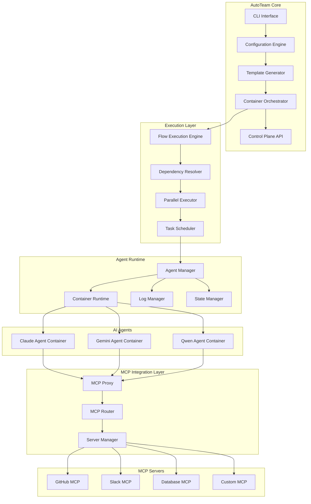
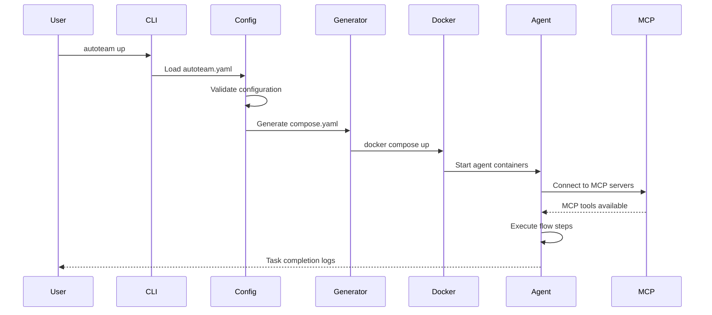
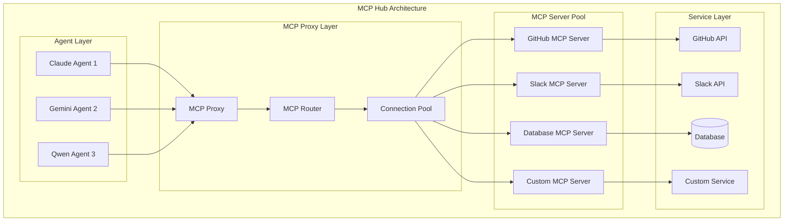

# Architecture

## Overview

AutoTeam is built as a cloud-native, container-first orchestration platform that connects AI agents with external services through the Model Context Protocol (MCP). The architecture emphasizes modularity, scalability, and platform independence.

## System Architecture



## Core Components

### CLI Interface

The command-line interface provides the primary interaction point:

```go
// cmd/autoteam/main.go
func main() {
    app := &cli.App{
        Name:    "autoteam",
        Usage:   "Universal AI Agent Orchestration Platform",
        Commands: []*cli.Command{
            initCommand(),
            generateCommand(),
            upCommand(),
            downCommand(),
        },
    }
    app.Run(os.Args)
}
```

**Key Responsibilities:**
- Configuration validation
- Template generation
- Container orchestration
- System lifecycle management

### Configuration Engine

Handles YAML configuration parsing and validation:

```go
// internal/config/config.go
type Config struct {
    Workers  []Worker  `yaml:"workers"`
    Settings Settings  `yaml:"settings"`
}

type Worker struct {
    Name     string         `yaml:"name"`
    Enabled  bool          `yaml:"enabled"`
    Prompt   string        `yaml:"prompt"`
    Settings WorkerSettings `yaml:"settings"`
}
```

**Features:**
- YAML schema validation
- Environment variable substitution
- Configuration merging (global → worker settings → worker level)
- Error reporting and debugging

### Flow Execution Engine

Orchestrates workflow execution with intelligent dependency resolution:

```go
// internal/flow/executor.go
type FlowExecutor struct {
    steps []FlowStep
    deps  map[string][]string
}

func (fe *FlowExecutor) Execute(ctx context.Context) error {
    levels := fe.resolveDependencies()
    
    for _, level := range levels {
        if err := fe.executeLevel(ctx, level); err != nil {
            return err
        }
    }
    
    return nil
}
```

**Capabilities:**
- Parallel execution within dependency levels
- Dynamic dependency resolution
- Conditional step execution
- Error handling and recovery
- Resource optimization

### Container Runtime

Manages AI agent containers using Docker:

```go
// internal/runtime/container.go
type ContainerManager struct {
    client *docker.Client
    config ContainerConfig
}

func (cm *ContainerManager) StartAgent(ctx context.Context, agent Agent) error {
    container := cm.createContainer(agent)
    return cm.client.ContainerStart(ctx, container.ID, types.ContainerStartOptions{})
}
```

**Features:**
- Container isolation per agent
- Resource management and limits
- Health monitoring
- Automatic restart on failure
- Log aggregation

## Data Flow

### Configuration to Execution



### Flow Execution Process

```mermaid
graph TB
    subgraph "Flow Execution Cycle"
        Start([Start])
        LoadConfig[Load Configuration]
        ParseFlow[Parse Flow Definition]
        ResolveDeps[Resolve Dependencies]
        GroupLevels[Group into Execution Levels]
        
        subgraph "Level Execution"
            StartLevel[Start Level N]
            ParallelExec[Execute Steps in Parallel]
            WaitComplete[Wait for All Steps]
            CheckErrors[Check for Errors]
            NextLevel[Next Level]
        end
        
        Complete([Complete])
    end
    
    Start --> LoadConfig
    LoadConfig --> ParseFlow
    ParseFlow --> ResolveDeps
    ResolveDeps --> GroupLevels
    GroupLevels --> StartLevel
    
    StartLevel --> ParallelExec
    ParallelExec --> WaitComplete
    WaitComplete --> CheckErrors
    CheckErrors --> NextLevel
    NextLevel --> StartLevel
    
    NextLevel --> Complete
    CheckErrors --> Complete
```



## Container Architecture

### Agent Containers

Each AI agent runs in an isolated container with dedicated resources:

```dockerfile
# Base agent container structure
FROM node:18.17.1

# Create agent user
RUN useradd -m -s /bin/bash developer

# Install dependencies
COPY requirements.txt .
RUN npm install -g @anthropic/claude-cli

# Copy agent binaries and configurations
COPY --from=builder /opt/autoteam/bin /opt/autoteam/bin
COPY agent-config /app/config

# Set up MCP configuration
COPY mcp-config.json /app/.claude/mcp.json

# Create working directories
RUN mkdir -p /app/workspace /app/logs /app/data
RUN chown -R developer:developer /app

USER developer
WORKDIR /app

ENTRYPOINT ["/opt/autoteam/bin/entrypoint.sh"]
```

### Directory Structure

```
.autoteam/
├── agents/
│   ├── {agent_name}/
│   │   ├── {flow_step}/           # Flow step workspace
│   │   │   ├── mcp.json          # MCP configuration
│   │   │   ├── data/             # Step-specific data
│   │   │   └── logs/             # Execution logs
│   │   └── shared/               # Shared agent resources
│   └── shared/                   # Global shared resources
├── compose.yaml                  # Generated Docker Compose
├── entrypoint.sh                # Container entrypoint script
└── logs/                        # System logs
```

## MCP Integration Architecture

### MCP Hub Design

AutoTeam acts as an intelligent MCP hub:



### MCP Server Lifecycle

```go
// internal/mcp/server.go
type MCPServer struct {
    Name    string
    Command string
    Args    []string
    Env     map[string]string
    Process *exec.Cmd
}

func (s *MCPServer) Start() error {
    s.Process = exec.Command(s.Command, s.Args...)
    s.Process.Env = s.buildEnvironment()
    
    return s.Process.Start()
}

func (s *MCPServer) Stop() error {
    if s.Process != nil {
        return s.Process.Process.Kill()
    }
    return nil
}
```

## Parallel Execution Engine

### Dependency Resolution Algorithm

```go
// internal/flow/dependency.go
func (r *DependencyResolver) ResolveLevels(steps []FlowStep) [][]FlowStep {
    levels := make([][]FlowStep, 0)
    remaining := make(map[string]FlowStep)
    completed := make(map[string]bool)
    
    // Initialize remaining steps
    for _, step := range steps {
        remaining[step.Name] = step
    }
    
    for len(remaining) > 0 {
        level := make([]FlowStep, 0)
        
        // Find steps with satisfied dependencies
        for name, step := range remaining {
            if r.dependenciesSatisfied(step, completed) {
                level = append(level, step)
                delete(remaining, name)
            }
        }
        
        // Mark level steps as completed
        for _, step := range level {
            completed[step.Name] = true
        }
        
        levels = append(levels, level)
    }
    
    return levels
}
```

### Parallel Execution Implementation

```go
// internal/flow/parallel.go
func (pe *ParallelExecutor) ExecuteLevel(ctx context.Context, steps []FlowStep) error {
    if len(steps) == 1 {
        // Single step optimization
        return pe.executeStep(ctx, steps[0])
    }
    
    var wg sync.WaitGroup
    errChan := make(chan error, len(steps))
    
    for _, step := range steps {
        wg.Add(1)
        go func(s FlowStep) {
            defer wg.Done()
            if err := pe.executeStep(ctx, s); err != nil {
                errChan <- err
            }
        }(step)
    }
    
    wg.Wait()
    close(errChan)
    
    // Check for errors
    for err := range errChan {
        if err != nil {
            return err
        }
    }
    
    return nil
}
```

## Logging and Monitoring

### Structured Logging

AutoTeam uses structured logging with contextual information:

```go
// internal/logging/logger.go
type Logger struct {
    *zap.Logger
}

func (l *Logger) WithContext(ctx context.Context) *Logger {
    return &Logger{
        Logger: l.Logger.With(
            zap.String("agent", getAgentFromContext(ctx)),
            zap.String("step", getStepFromContext(ctx)),
            zap.String("trace_id", getTraceIDFromContext(ctx)),
        ),
    }
}
```

### Log Organization

```
logs/
├── system/
│   ├── autoteam.log              # Main system log
│   ├── flow-executor.log         # Flow execution log
│   └── mcp-proxy.log            # MCP communication log
├── agents/
│   ├── {agent_name}/
│   │   ├── agent.log            # Agent-specific log
│   │   └── tasks/
│   │       ├── {timestamp}-{task}.log
│   │       └── ...
└── containers/
    ├── docker-compose.log        # Container orchestration
    └── container-{id}.log       # Individual container logs
```

## Performance Characteristics

### Execution Performance

- **Parallel Speedup**: 3-5x improvement for independent tasks
- **Memory Efficiency**: 40% lower memory usage vs separate processes
- **Response Time**: Sub-30-second average for GitHub notifications
- **Throughput**: 50+ concurrent MCP connections

### Resource Management

```yaml
# Container resource limits
services:
  agent:
    deploy:
      resources:
        limits:
          memory: 512M
          cpus: '0.5'
        reservations:
          memory: 256M
          cpus: '0.25'
```

### Scaling Characteristics

- **Horizontal Scaling**: Add more agent containers
- **Vertical Scaling**: Increase container resources
- **MCP Server Pooling**: Share MCP servers across agents
- **Load Balancing**: Distribute work across available agents

## Security Architecture

### Container Isolation

- Each agent runs in isolated containers
- Network segmentation between agents
- Resource limits prevent resource exhaustion
- Read-only filesystems where appropriate

### Secret Management

```go
// internal/security/secrets.go
type SecretManager struct {
    store map[string]string
}

func (sm *SecretManager) GetSecret(key string) (string, error) {
    if value, exists := sm.store[key]; exists {
        return value, nil
    }
    return "", ErrSecretNotFound
}
```

### MCP Security

- MCP servers run with minimal privileges
- Authentication tokens isolated per agent
- Network access restricted to required services
- Audit logging for all MCP communications

## Extension Points

### Custom Agent Types

```go
// internal/agents/interface.go
type Agent interface {
    Name() string
    Type() string
    Execute(ctx context.Context, prompt string) (*AgentOutput, error)
    Configure(config AgentConfig) error
    HealthCheck() error
}

// Implement custom agent
type CustomAgent struct {
    name   string
    config AgentConfig
}

func (ca *CustomAgent) Execute(ctx context.Context, prompt string) (*AgentOutput, error) {
    // Custom agent implementation
    return &AgentOutput{}, nil
}
```

### Custom MCP Servers

Extend AutoTeam with custom MCP servers for proprietary systems:

```go
// Custom MCP server template
type CustomMCPServer struct {
    config ServerConfig
    client *http.Client
}

func (s *CustomMCPServer) HandleTool(name string, params map[string]interface{}) (interface{}, error) {
    switch name {
    case "custom_action":
        return s.customAction(params)
    default:
        return nil, fmt.Errorf("unknown tool: %s", name)
    }
}
```

## Deployment Architecture

### Development Deployment

```yaml
# docker-compose.yml for development
services:
  autoteam-agent:
    build: .
    environment:
      - NODE_ENV=development
      - LOG_LEVEL=debug
    volumes:
      - ./src:/app/src
      - ./data:/app/data
    ports:
      - "3000:3000"
```

### Production Deployment

```yaml
# docker-compose.prod.yml
services:
  autoteam-agent:
    image: autoteam/agent:latest
    deploy:
      replicas: 3
      restart_policy:
        condition: on-failure
        max_attempts: 3
      resources:
        limits:
          memory: 1G
          cpus: '1.0'
    environment:
      - NODE_ENV=production
      - LOG_LEVEL=info
    volumes:
      - agent-data:/app/data
    networks:
      - autoteam-network

networks:
  autoteam-network:
    driver: overlay

volumes:
  agent-data:
    driver: local
```

## Next Steps

- [Examples](examples.md) - Real-world architecture examples
- [Development](development.md) - Contributing to AutoTeam architecture
- [Configuration](configuration.md) - Advanced configuration patterns