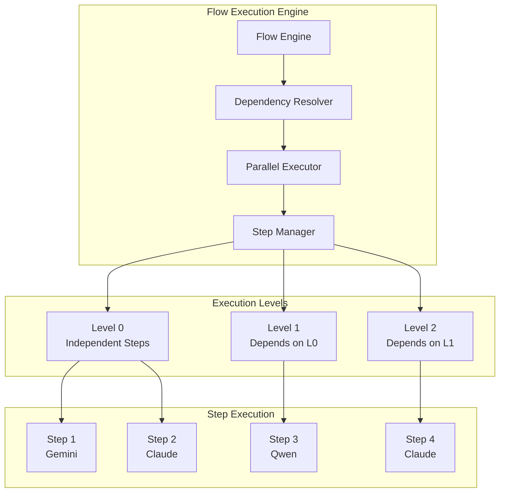
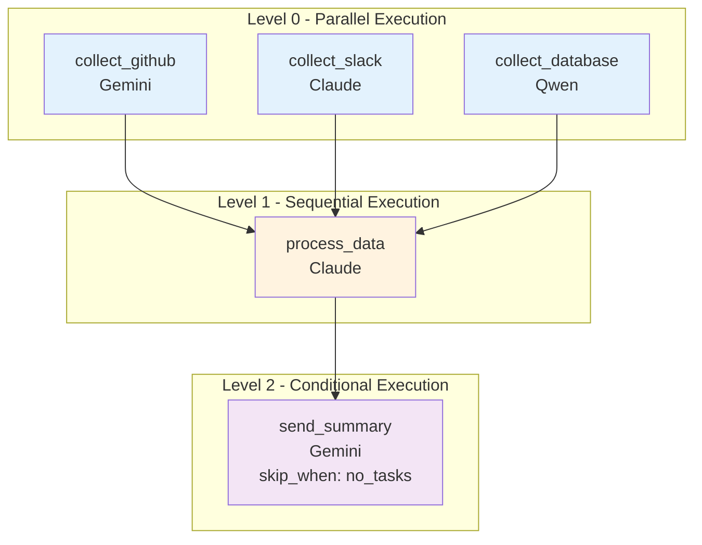

# Flow System

## Overview

AutoTeam's flow system orchestrates AI agents through intelligent workflow execution. Flows define sequences of steps with dependency resolution and parallel execution capabilities.

## Flow Architecture



## Basic Flow Definition

Flows are defined in the `settings.flow` section of `autoteam.yaml`:

```yaml
settings:
  flow:
    - name: step_name
      type: agent_type        # claude, gemini, or qwen
      prompt: "Step instructions"
      depends_on: []          # Dependencies (optional)
      skip_when: ""           # Skip condition (optional)
      args: []                # Agent-specific arguments (optional)
```

## Simple Sequential Flow

```yaml
settings:
  flow:
    - name: collect_data
      type: gemini
      prompt: |
        Collect data from available MCP sources.
        Focus on urgent items that need attention.
    
    - name: analyze_data
      type: claude
      depends_on: [collect_data]
      prompt: |
        Analyze the collected data and determine actions needed.
        Use context from the previous step.
    
    - name: take_actions
      type: claude
      depends_on: [analyze_data]
      prompt: |
        Execute the recommended actions using appropriate MCP tools.
```

## Parallel Flow Execution

The flow engine automatically detects independent steps and executes them in parallel:

```yaml
settings:
  flow:
    # Level 0 - Run in parallel (no dependencies)
    - name: scan_github
      type: gemini
      prompt: "Scan GitHub notifications and issues"
    
    - name: scan_slack
      type: claude
      prompt: "Check Slack for mentions and messages"
    
    - name: scan_database
      type: qwen
      prompt: "Query database for pending operations"
    
    # Level 1 - Waits for Level 0 to complete
    - name: process_all_data
      type: claude
      depends_on: [scan_github, scan_slack, scan_database]
      prompt: |
        Process all collected information from GitHub, Slack, and database.
        Prioritize based on urgency and context.
    
    # Level 2 - Optional summary step
    - name: send_summary
      type: gemini
      depends_on: [process_all_data]
      skip_when: "{{- index .inputs 0 | contains \"No tasks processed\" -}}"
      prompt: "Send summary of completed actions to team"
```

## Dependency Resolution

### Execution Levels

The flow engine groups steps into execution levels:

- **Level 0**: Steps with no dependencies (run in parallel)
- **Level 1**: Steps depending only on Level 0 steps
- **Level 2**: Steps depending on Level 1 steps
- And so on...



### Complex Dependencies

Steps can depend on multiple other steps:

```yaml
settings:
  flow:
    - name: fetch_code
      type: gemini
      prompt: "Fetch latest code changes"
    
    - name: fetch_tests
      type: gemini
      prompt: "Fetch test results and coverage"
    
    - name: fetch_issues
      type: claude
      prompt: "Fetch related issues and discussions"
    
    - name: comprehensive_review
      type: claude
      depends_on: [fetch_code, fetch_tests, fetch_issues]
      prompt: |
        Perform comprehensive code review using:
        - Code changes from fetch_code
        - Test results from fetch_tests
        - Context from fetch_issues
```

## Conditional Execution

Steps can be skipped based on runtime conditions using Go templates:

### Skip When Syntax

```yaml
skip_when: "template_expression"
```

The template has access to:
- `.inputs` - Array of outputs from dependency steps
- `.step` - Current step information
- `.worker` - Worker configuration
- `.flow` - Flow configuration

### Skip Examples

```yaml
settings:
  flow:
    - name: check_notifications
      type: gemini
      prompt: "Check for new notifications"
    
    - name: handle_urgent_only
      type: claude
      depends_on: [check_notifications]
      skip_when: "{{- index .inputs 0 | contains \"No urgent notifications\" -}}"
      prompt: "Handle only urgent notifications"
    
    - name: send_daily_summary
      type: gemini
      depends_on: [check_notifications]
      skip_when: "{{- now.Hour | lt 17 -}}"  # Skip before 5 PM
      prompt: "Send end-of-day summary"
    
    - name: weekend_maintenance
      type: qwen
      skip_when: "{{- now.Weekday | ge 1 | and (now.Weekday | le 5) -}}"  # Skip weekdays
      prompt: "Perform weekend maintenance tasks"
```

## Input and Output Handling

### Step Inputs

Steps receive inputs from their dependencies through the `.inputs` array:

```yaml
- name: process_results
  type: claude
  depends_on: [step1, step2, step3]
  prompt: |
    Process the following inputs:
    - GitHub data: {{index .inputs 0}}
    - Slack data: {{index .inputs 1}}
    - Database data: {{index .inputs 2}}
    
    Take appropriate actions based on this information.
```

### Output Transformation

Steps can transform their output using Go templates:

```yaml
- name: extract_summary
  type: claude
  prompt: "Analyze data and provide summary"
  output: |
    Summary: {{- .stdout | regexFind "SUMMARY: (.*)" | regexReplaceAll "SUMMARY: " "" -}}
```

## Agent-Specific Arguments

Different agents support different arguments:

### Claude Arguments

```yaml
- name: detailed_analysis
  type: claude
  args: ["--output-format", "stream-json", "--print"]
  prompt: "Perform detailed analysis"
```

### Gemini Arguments

```yaml
- name: quick_scan
  type: gemini
  args: ["--model", "gemini-2.5-flash", "--temperature", "0.1"]
  prompt: "Quick scan of available data"
```

### Qwen Arguments

```yaml
- name: data_processing
  type: qwen
  args: ["--temperature", "0.2", "--max-tokens", "2048"]
  prompt: "Process and structure data"
```

## Flow Examples

### Development Workflow

```yaml
settings:
  flow:
    # Parallel information gathering
    - name: scan_prs
      type: gemini
      args: ["--model", "gemini-2.5-flash"]
      prompt: "Scan for pull requests needing review"
    
    - name: scan_issues
      type: gemini
      args: ["--model", "gemini-2.5-flash"]
      prompt: "Scan for issues needing attention"
    
    - name: scan_discussions
      type: claude
      prompt: "Check GitHub discussions for developer questions"
    
    # Specialized processing
    - name: handle_pr_reviews
      type: claude
      depends_on: [scan_prs]
      skip_when: "{{- index .inputs 0 | contains \"No PRs\" -}}"
      prompt: "Review and comment on pull requests"
    
    - name: triage_issues
      type: claude
      depends_on: [scan_issues]
      skip_when: "{{- index .inputs 0 | contains \"No issues\" -}}"
      prompt: "Triage and label issues appropriately"
    
    - name: answer_questions
      type: claude
      depends_on: [scan_discussions]
      skip_when: "{{- index .inputs 0 | contains \"No questions\" -}}"
      prompt: "Answer developer questions in discussions"
    
    # Summary and notifications
    - name: team_update
      type: gemini
      depends_on: [handle_pr_reviews, triage_issues, answer_questions]
      prompt: "Send team update on automated actions taken"
```

### Multi-Platform Coordination

```yaml
settings:
  flow:
    # Platform-specific data collection
    - name: github_status
      type: gemini
      prompt: "Collect GitHub repository status and activities"
    
    - name: slack_status
      type: claude
      prompt: "Check Slack for team communications and blockers"
    
    - name: jira_status
      type: qwen
      prompt: "Query Jira for sprint progress and impediments"
    
    - name: deployment_status
      type: gemini
      prompt: "Check CI/CD pipeline and deployment status"
    
    # Coordination and sync
    - name: identify_blockers
      type: claude
      depends_on: [github_status, slack_status, jira_status, deployment_status]
      prompt: |
        Analyze all platform data to identify blockers and coordination issues:
        - GitHub: {{index .inputs 0}}
        - Slack: {{index .inputs 1}}
        - Jira: {{index .inputs 2}}
        - Deployment: {{index .inputs 3}}
    
    - name: sync_platforms
      type: claude
      depends_on: [identify_blockers]
      skip_when: "{{- index .inputs 0 | contains \"No sync needed\" -}}"
      prompt: "Synchronize information between platforms and update statuses"
    
    - name: escalate_issues
      type: claude
      depends_on: [identify_blockers]
      skip_when: "{{- index .inputs 0 | contains \"No escalation needed\" -}}"
      prompt: "Escalate critical blockers to appropriate team members"
```

## Performance Considerations

### Parallel Execution Benefits

- **3-5x faster** than sequential execution for independent tasks
- **Optimal resource utilization** across multiple AI agents
- **Reduced end-to-end workflow time** for complex processes

### Best Practices

1. **Minimize Dependencies**: Design flows with maximum parallelism
2. **Use Appropriate Agents**: Match agent capabilities to task requirements
3. **Implement Skip Conditions**: Avoid unnecessary work with smart conditionals
4. **Monitor Resource Usage**: Balance parallel execution with system resources

## Debugging Flows

### Flow Validation

```bash
# Validate flow configuration
autoteam validate

# Dry-run flow execution
autoteam generate --dry-run
```

### Execution Logging

Each step creates detailed logs in `.autoteam/agents/{agent}/logs/`:

```
.autoteam/agents/senior_developer/logs/
├── 20250124-143022-scan_github.log
├── 20250124-143022-scan_slack.log
├── 20250124-143025-process_all_data.log
└── 20250124-143027-send_summary.log
```

### Common Issues

- **Circular Dependencies**: Steps that depend on each other directly or indirectly
- **Missing Dependencies**: Referenced steps that don't exist
- **Template Errors**: Invalid Go template syntax in skip conditions
- **Agent Failures**: Individual step failures that block dependent steps

## Next Steps

- [MCP Integration](mcp.md) - Connect platforms for flow execution
- [Examples](examples.md) - Real-world flow configurations
- [Architecture](architecture.md) - Deep dive into flow execution engine